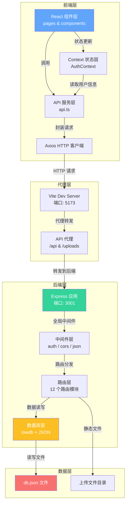
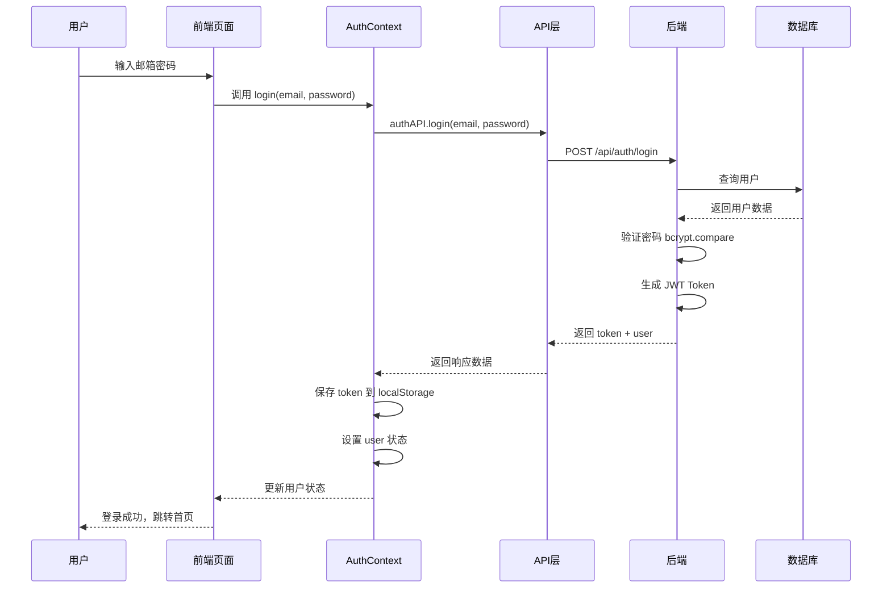
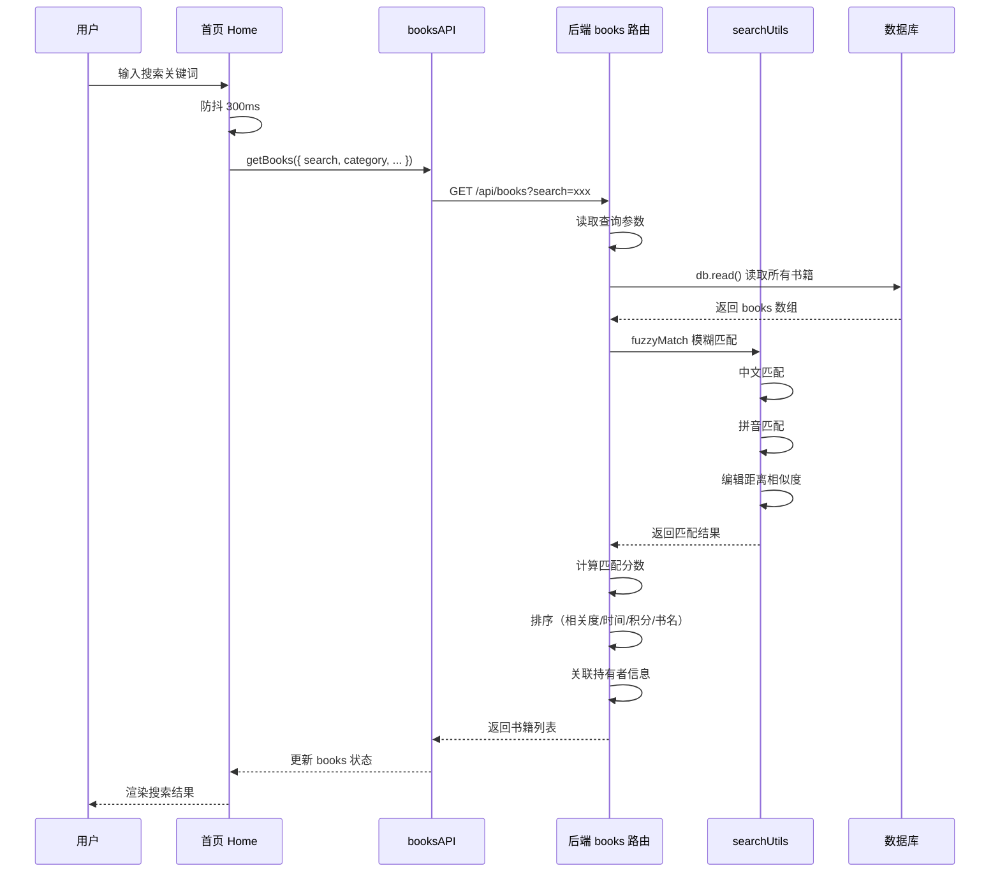
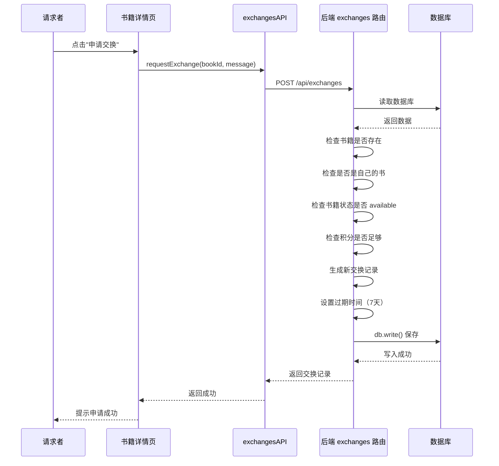
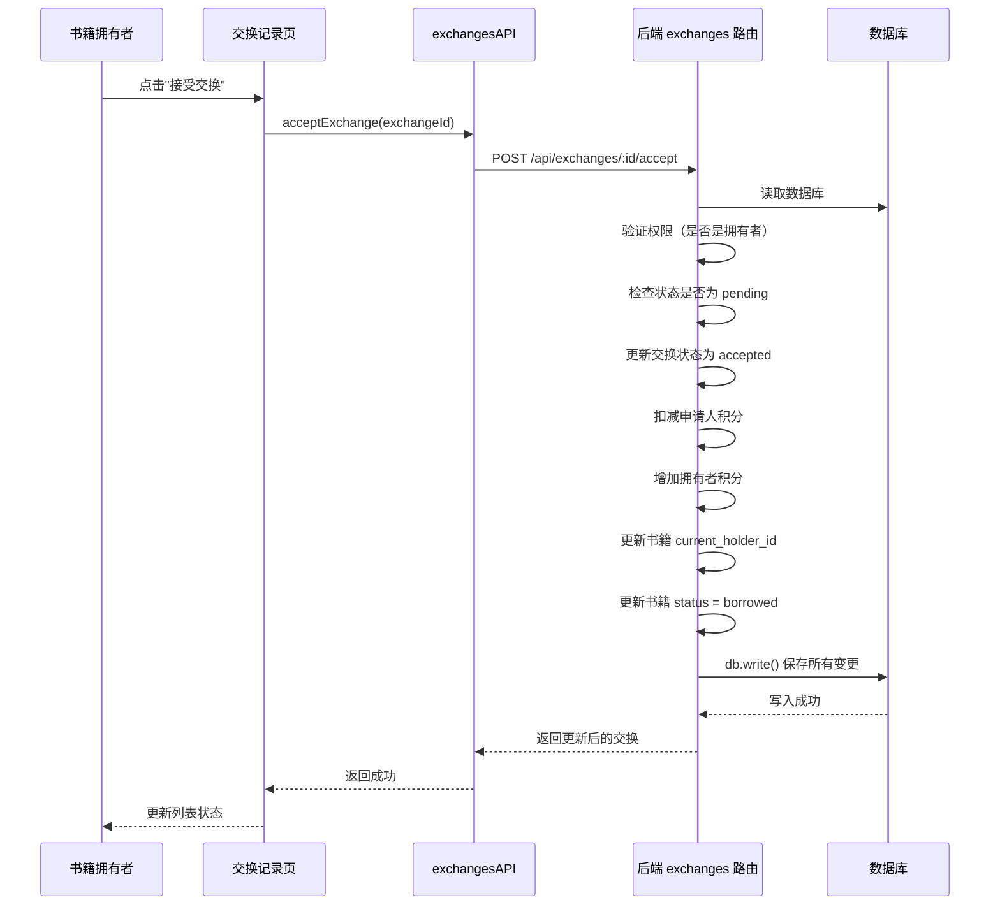
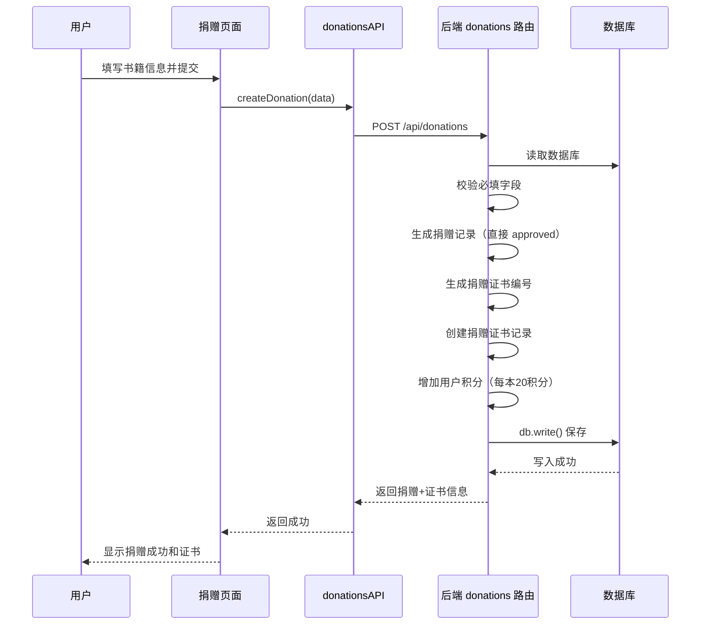
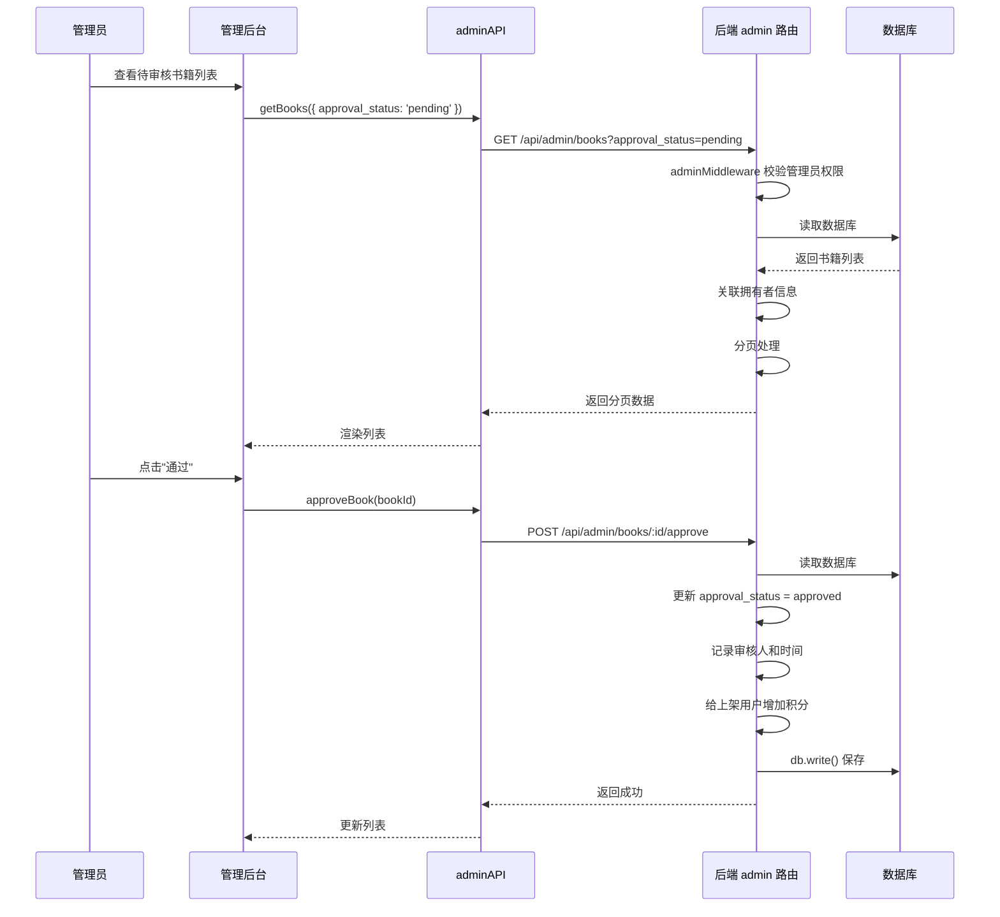
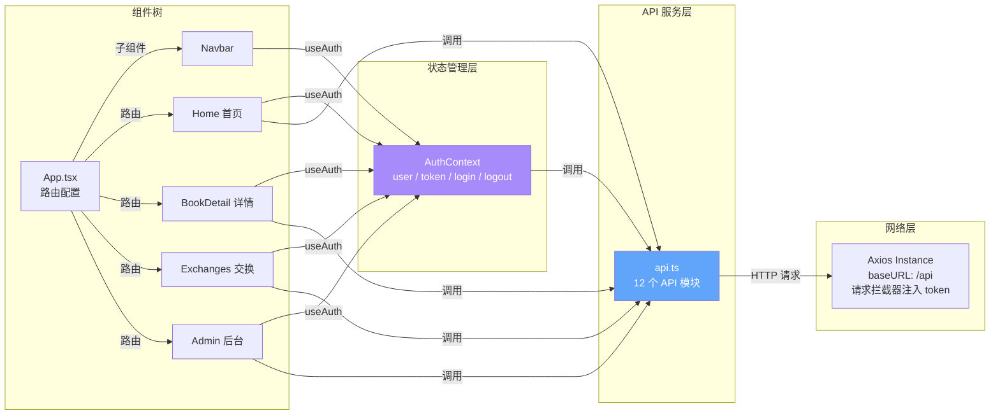

# 漂流平台 - 二手书交换社区

> 面向爱书人的社区型二手书交换平台，以书换书，用积分发现更多好书。每一本书都有属于它的漂流故事。

## 目录

- [项目简介](#项目简介)
- [技术栈](#技术栈)
- [项目结构](#项目结构)
- [功能模块](#功能模块)
- [数据模型](#数据模型)
- [数据流向分析](#数据流向分析)
- [安装与运行](#安装与运行)
- [API 接口概览](#api-接口概览)
- [开发说明](#开发说明)

---

## 项目简介

漂流平台是一个社区型的二手书交换平台，用户可以将自己的闲置书籍上架，通过积分系统与其他用户进行书籍交换。平台同时提供社区讨论、阅读目标、成就系统、读书俱乐部、图书捐赠等丰富功能，打造一个有温度的读书人社群。

### 核心特色

- 📚 **书籍漂流**：每本书都有完整的漂流记录，见证知识的传递
- 🪙 **积分体系**：上架书籍、完成交换、捐赠图书均可获得积分
- 👥 **社区互动**：话题讨论、书评分享、读书打卡、关注好友
- 🎯 **阅读目标**：设定阅读计划，追踪阅读进度
- 🏆 **成就系统**：多种成就徽章，激励持续阅读
- 📖 **读书俱乐部**：线下读书会组织与报名
- 🎁 **图书捐赠**：捐赠图书获得证书，爱心传递

---

## 技术栈

### 前端技术栈

| 技术 | 版本 | 用途 |
|------|------|------|
| React | 18.2.0 | UI 框架 |
| TypeScript | 5.2.2 | 类型安全 |
| Vite | 5.0.0 | 构建工具 |
| React Router | 6.20.0 | 路由管理 |
| Tailwind CSS | 3.3.5 | CSS 框架 |
| Axios | 1.6.2 | HTTP 客户端 |
| Lucide React | 0.294.0 | 图标库 |
| Recharts | 3.8.1 | 图表库 |
| React Markdown | 10.1.0 | Markdown 渲染 |

### 后端技术栈

| 技术 | 版本 | 用途 |
|------|------|------|
| Express | 4.18.2 | Web 框架 |
| TypeScript | 5.2.2 | 类型安全 |
| lowdb | 7.0.1 | JSON 文件数据库 |
| JSON Web Token | 9.0.2 | 身份认证 |
| bcryptjs | 2.4.3 | 密码加密 |
| Multer | 2.1.1 | 文件上传 |
| pinyin-pro | 3.28.1 | 拼音搜索 |
| CORS | 2.8.5 | 跨域支持 |

---

## 项目结构

```
yq-23-new/
├── client/                     # 前端项目
│   ├── src/
│   │   ├── components/         # 公共组件
│   │   │   ├── AdminRoute.tsx      # 管理员路由守卫
│   │   │   ├── AdminSidebar.tsx    # 管理后台侧边栏
│   │   │   ├── BookCard.tsx        # 书籍卡片组件
│   │   │   └── Navbar.tsx          # 导航栏
│   │   ├── contexts/           # React Context
│   │   │   └── AuthContext.tsx     # 认证上下文
│   │   ├── pages/              # 页面组件
│   │   │   ├── admin/              # 管理后台页面
│   │   │   │   ├── AdminDashboard.tsx
│   │   │   │   ├── AdminBooks.tsx
│   │   │   │   ├── AdminUsers.tsx
│   │   │   │   ├── AdminExchanges.tsx
│   │   │   │   ├── AdminPosts.tsx
│   │   │   │   ├── AdminDonations.tsx
│   │   │   │   └── AdminClubs.tsx
│   │   │   ├── Home.tsx             # 首页
│   │   │   ├── Login.tsx            # 登录页
│   │   │   ├── Register.tsx         # 注册页
│   │   │   ├── BookDetail.tsx       # 书籍详情
│   │   │   ├── AddBook.tsx          # 添加书籍
│   │   │   ├── MyBooks.tsx          # 我的书架
│   │   │   ├── Exchanges.tsx        # 交换记录
│   │   │   ├── Topics.tsx           # 话题社区
│   │   │   ├── Wishlists.tsx        # 心愿单
│   │   │   ├── ReadingGoals.tsx     # 阅读目标
│   │   │   ├── Achievements.tsx     # 成就系统
│   │   │   ├── ReadingClubs.tsx     # 读书俱乐部
│   │   │   ├── ReadingStats.tsx     # 阅读统计
│   │   │   ├── DonateBook.tsx       # 图书捐赠
│   │   │   ├── DonationRanking.tsx  # 捐赠排行榜
│   │   │   └── ...
│   │   ├── services/           # API 服务层
│   │   │   └── api.ts              # API 接口封装
│   │   ├── App.tsx             # 应用根组件
│   │   ├── main.tsx            # 入口文件
│   │   └── index.css           # 全局样式
│   ├── index.html
│   ├── package.json
│   ├── vite.config.ts          # Vite 配置（含代理）
│   ├── tailwind.config.js
│   └── tsconfig.json
│
├── server/                     # 后端项目
│   ├── data/
│   │   └── db.json             # 数据库文件（lowdb）
│   ├── src/
│   │   ├── middleware/         # 中间件
│   │   │   └── auth.ts             # 认证中间件
│   │   ├── routes/             # 路由模块
│   │   │   ├── auth.ts             # 认证接口
│   │   │   ├── books.ts            # 书籍接口
│   │   │   ├── exchanges.ts        # 交换接口
│   │   │   ├── topics.ts           # 话题接口
│   │   │   ├── upload.ts           # 上传接口
│   │   │   ├── wishlists.ts        # 心愿单接口
│   │   │   ├── goals.ts            # 阅读目标接口
│   │   │   ├── achievements.ts     # 成就接口
│   │   │   ├── reading-clubs.ts    # 读书俱乐部接口
│   │   │   ├── users.ts            # 用户接口
│   │   │   ├── stats.ts            # 统计接口
│   │   │   ├── donations.ts        # 捐赠接口
│   │   │   └── admin.ts            # 管理员接口
│   │   ├── utils/              # 工具函数
│   │   │   └── searchUtils.ts      # 搜索工具（拼音模糊匹配）
│   │   ├── database.ts         # 数据库初始化与类型定义
│   │   └── index.ts            # 服务入口
│   ├── package.json
│   └── tsconfig.json
│
└── package.json                # 根 package.json（统一脚本）
```

---

## 功能模块

### 1. 用户认证模块

- 用户注册/登录
- JWT Token 认证
- 密码 bcrypt 加密存储
- 用户角色区分（普通用户 / 管理员）
- 账号封禁功能

### 2. 书籍管理模块

- 书籍上架/下架
- 单本添加 / 批量添加
- 书籍信息编辑
- 书籍搜索（支持拼音模糊匹配）
- 分类筛选、新旧程度筛选、积分范围筛选
- 漂流记录查看
- 书籍导出（JSON / CSV）

### 3. 书籍交换模块

- 发起交换申请
- 接受 / 拒绝交换
- 取消交换申请
- 交换状态流转（待处理 → 已接受 → 进行中 → 已完成）
- 交换过期自动处理
- 交换互评（1-5星）
- 积分扣减与增加

### 4. 社区话题模块

- 话题分类
- 发布帖子（支持 Markdown）
- 帖子评论（支持回复）
- 点赞功能
- 关注用户动态流

### 5. 心愿单模块

- 创建心愿单
- 添加/移除书籍
- 批量操作
- 默认心愿单

### 6. 阅读目标模块

- 创建阅读目标
- 添加目标书籍
- 标记完成
- 进度追踪

### 7. 成就系统模块

- 多种成就类型（阅读、目标、社交、收藏）
- 自动检测解锁
- 成就徽章展示
- 积分奖励

### 8. 读书俱乐部模块

- 创建读书会
- 报名 / 取消报名
- 活动状态管理
- 参与者管理

### 9. 图书捐赠模块

- 捐赠图书
- 捐赠证书生成
- 捐赠排行榜
- 捐赠统计

### 10. 管理员后台

- 数据统计概览
- 书籍审核（通过 / 拒绝）
- 用户管理（封禁 / 解封 / 角色调整）
- 积分管理
- 帖子管理
- 捐赠审核
- 读书会管理

---

## 数据模型

数据库使用 lowdb（JSON 文件数据库），包含以下数据集合：

### 用户 (users)

| 字段 | 类型 | 说明 |
|------|------|------|
| id | number | 用户ID |
| username | string | 用户名 |
| email | string | 邮箱 |
| password | string | 加密后的密码 |
| points | number | 积分 |
| avatar | string | 头像URL |
| bio | string | 个人简介 |
| role | 'user' \| 'admin' | 角色 |
| status | 'active' \| 'banned' | 状态 |
| created_at | string | 创建时间 |

### 书籍 (books)

| 字段 | 类型 | 说明 |
|------|------|------|
| id | number | 书籍ID |
| title | string | 书名 |
| author | string | 作者 |
| cover | string | 封面图片 |
| description | string | 描述 |
| isbn | string | ISBN |
| category | string | 分类 |
| condition | string | 新旧程度 |
| owner_id | number | 拥有者ID |
| current_holder_id | number | 当前持有者ID |
| status | 'available' \| 'borrowed' \| 'lost' \| 'removed' | 状态 |
| approval_status | 'pending' \| 'approved' \| 'rejected' | 审核状态 |
| points_required | number | 所需积分 |
| created_at | string | 创建时间 |

### 交换记录 (exchanges)

| 字段 | 类型 | 说明 |
|------|------|------|
| id | number | 交换ID |
| book_id | number | 书籍ID |
| requester_id | number | 申请人ID |
| owner_id | number | 拥有者ID |
| status | ExchangeStatus | 状态 |
| message | string | 申请留言 |
| borrow_days | number | 借阅天数 |
| expires_at | string | 过期时间 |
| created_at / accepted_at / started_at / completed_at | string | 各阶段时间 |

### 漂流记录 (driftRecords)

记录每本书经过的读者，包含阅读笔记和评分。

### 话题与帖子 (topics / posts / comments)

社区讨论相关的数据模型，支持多级评论和点赞。

### 其他数据模型

- 心愿单 (wishlists / wishlistItems)
- 阅读目标 (readingGoals / goalBooks)
- 成就 (achievements / userAchievements)
- 读书俱乐部 (readingClubs / readingClubParticipants)
- 捐赠 (donations / donationCertificates)
- 关注关系 (follows)
- 交换评价 (exchangeReviews)
- 搜索历史 (searchHistories)

---

## 数据流向分析

### 整体架构流程图



### 用户认证数据流



### 书籍查询数据流



### 发起书籍交换数据流



### 接受交换数据流



### 捐赠图书数据流



### 管理员审核书籍数据流



### 前端状态管理与数据流



### 后端中间件与路由数据流

```mermaid
graph TD
    REQ[HTTP 请求] --> CORS[CORS 中间件<br/>允许跨域]
    CORS --> JSON[JSON 解析中间件<br/>express.json()]
    JSON --> ROUTER[路由分发<br/>/api/*]

    ROUTER --> AUTH_ROUTE[认证路由<br/>/api/auth]
    ROUTER --> BOOK_ROUTE[书籍路由<br/>/api/books]
    ROUTER --> EXCH_ROUTE[交换路由<br/>/api/exchanges]
    ROUTER --> ADMIN_ROUTE[管理员路由<br/>/api/admin]
    ROUTER --> OTHER_ROUTE[其他路由...]

    AUTH_ROUTE -->|公开接口| AUTH_HANDLER[处理器]
    BOOK_ROUTE -->|部分接口需要| AUTH_MID[authMiddleware<br/>JWT 验证]
    EXCH_ROUTE -->|全部需要| AUTH_MID
    ADMIN_ROUTE -->|全部需要| ADMIN_MID[adminMiddleware<br/>JWT + 角色验证]

    AUTH_MID -->|req.user| HANDLER[业务处理器]
    ADMIN_MID -->|req.user| ADMIN_HANDLER[管理员处理器]

    HANDLER --> DB_OPS[数据库操作<br/>db.read() / db.write()]
    ADMIN_HANDLER --> DB_OPS

    DB_OPS --> JSON_FILE[db.json]

    style AUTH_MID fill:#fbbf24,color:white
    style ADMIN_MID fill:#f87171,color:white
    style DB_OPS fill:#34d399,color:white
```

### 数据库读写流程

```mermaid
flowchart TD
    START[开始数据库操作] --> READ{需要读取数据?}

    READ -->|是| R1[db.read()]
    R1 --> R2[从 db.json 文件加载数据到内存]
    R2 --> R3[数据存储在 db.data 中]
    R3 --> OPERATE[业务逻辑操作<br/>过滤 / 映射 / 计算]

    READ -->|否| OPERATE

    OPERATE --> WRITE{需要写入数据?}
    WRITE -->|是| W1[修改 db.data 中的数据]
    W1 --> W2[db.write()]
    W2 --> W3[将内存数据序列化写入 db.json]
    W3 --> END[返回结果]

    WRITE -->|否| END

    style R2 fill:#60a5fa,color:white
    style W2 fill:#34d399,color:white
```

---

## 安装与运行

### 环境要求

- Node.js >= 16
- npm >= 7

### 一键安装

```bash
npm run install:all
```

### 分步安装

```bash
# 安装根依赖
npm install

# 安装后端依赖
cd server && npm install

# 安装前端依赖
cd ../client && npm install
```

### 开发模式运行

```bash
# 同时启动前后端
npm run dev

# 或分别启动
npm run dev:server   # 后端，端口 3001
npm run dev:client   # 前端，端口 5173
```

### 生产构建

```bash
# 构建后端
npm run build:server

# 构建前端
npm run build:client
```

### 启动生产服务

```bash
npm start
```

### 初始化数据库

首次运行时会自动初始化数据库并插入示例数据。

默认账号：
- 管理员：admin@example.com / admin123
- 普通用户：booklover@example.com / password123

---

## API 接口概览

### 认证接口 `/api/auth`

| 方法 | 路径 | 说明 | 认证 |
|------|------|------|------|
| POST | /register | 用户注册 | 否 |
| POST | /login | 用户登录 | 否 |
| GET | /me | 获取当前用户信息 | 是 |

### 书籍接口 `/api/books`

| 方法 | 路径 | 说明 | 认证 |
|------|------|------|------|
| GET | / | 获取书籍列表 | 可选 |
| GET | /categories | 获取分类列表 | 否 |
| GET | /search-history | 获取搜索历史 | 是 |
| POST | /search-history | 添加搜索历史 | 是 |
| POST | / | 上架书籍 | 是 |
| POST | /batch | 批量上架 | 是 |
| GET | /:id | 书籍详情 | 可选 |
| PUT | /:id | 编辑书籍 | 是 |
| DELETE | /:id | 删除书籍 | 是 |
| GET | /:id/drift-records | 漂流记录 | 否 |
| POST | /:id/drift-records | 添加漂流记录 | 是 |

### 交换接口 `/api/exchanges`

| 方法 | 路径 | 说明 | 认证 |
|------|------|------|------|
| POST | / | 申请交换 | 是 |
| GET | / | 我的交换列表 | 是 |
| GET | /:id | 交换详情 | 是 |
| POST | /:id/accept | 接受交换 | 是 |
| POST | /:id/reject | 拒绝交换 | 是 |
| POST | /:id/cancel | 取消申请 | 是 |
| POST | /:id/start | 开始交换 | 是 |
| POST | /:id/complete | 完成交换 | 是 |
| POST | /:id/review | 评价交换 | 是 |

### 管理员接口 `/api/admin`

| 方法 | 路径 | 说明 | 认证 |
|------|------|------|------|
| GET | /stats | 统计概览 | 管理员 |
| GET | /books | 书籍列表 | 管理员 |
| POST | /books/:id/approve | 审核通过 | 管理员 |
| POST | /books/:id/reject | 审核拒绝 | 管理员 |
| GET | /users | 用户列表 | 管理员 |
| PUT | /users/:id/ban | 封禁用户 | 管理员 |
| PUT | /users/:id/unban | 解封用户 | 管理员 |
| PUT | /users/:id/role | 修改角色 | 管理员 |
| PUT | /users/:id/points | 调整积分 | 管理员 |

### 其他接口

- **话题社区** `/api/topics/*` - 话题、帖子、评论、点赞
- **心愿单** `/api/wishlists/*` - 心愿单管理
- **阅读目标** `/api/goals/*` - 目标管理
- **成就系统** `/api/achievements/*` - 成就查询与解锁
- **读书俱乐部** `/api/reading-clubs/*` - 俱乐部管理
- **用户** `/api/users/*` - 用户资料、关注、动态
- **统计** `/api/stats/*` - 阅读统计、数据导出
- **捐赠** `/api/donations/*` - 图书捐赠、排行榜、证书
- **上传** `/api/upload/*` - 图片上传

---

## 开发说明

### 前端开发

- 使用 Vite 作为构建工具，支持热更新
- 使用 Tailwind CSS 进行样式开发
- 使用 React Context 进行状态管理
- API 调用统一封装在 `services/api.ts`
- 所有 API 请求自动携带 JWT Token

### 后端开发

- 使用 Express + TypeScript
- 使用 lowdb 作为数据库（JSON 文件）
- 中间件模式：authMiddleware / adminMiddleware
- 路由模块化，每个资源一个路由文件

### 搜索功能

- 支持中文全文匹配
- 支持拼音搜索（全拼 + 首字母）
- 支持模糊匹配（编辑距离算法）
- 搜索结果按相关度排序

### 积分规则

- 新用户注册：100 积分
- 上架书籍被审核通过：获得书籍所需积分
- 完成交换（拥有者）：获得书籍所需积分
- 完成交换（申请者）：扣除书籍所需积分
- 捐赠图书：每本 20 积分
- 解锁成就：不等积分奖励

### 注意事项

1. **数据库文件**：`server/data/db.json` 为数据库文件，开发时注意不要误删
2. **上传文件**：上传的图片存储在 `server/uploads/` 目录
3. **JWT 密钥**：默认密钥为 `book-exchange-secret-key`，生产环境请配置环境变量 `JWT_SECRET`
4. **跨域配置**：开发时通过 Vite 代理解决跨域，生产环境需配置 CORS
5. **交换过期**：待处理的交换申请 7 天后自动过期

---

## 许可证

MIT License
